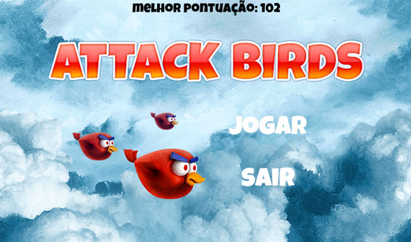
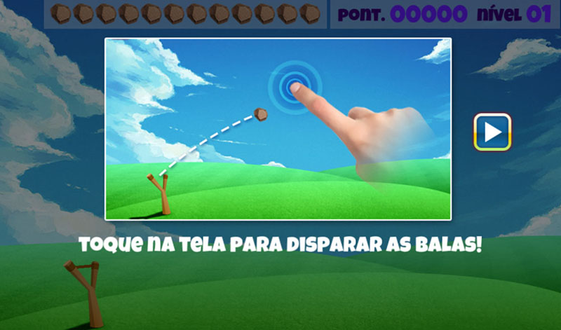
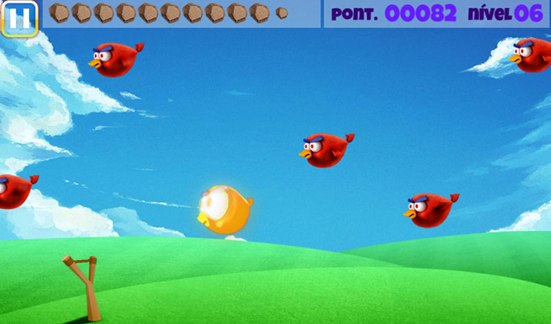

# Game <a href="https://github.com/DavidVSantiago/AttackBirds/blob/main/bin/BirdAttack.apk" target="_blank">AttackBirds </a>

Jogo desenvolvido em Java + biblioteca OpenGL ES, para a plataforma Android.<br>
[Clique aqui](https://github.com/DavidVSantiago/AttackBirds/blob/main/bin/BirdAttack.apk) para baixar o arquivo .apk do jogo.

## Ilustrações do jogo em execução




## Dependêcias

* ```Android Studio```. Você precisará ter o ambiente de desenvolvimento Android com suporte mínimo para a SDK versão 9.
* ```AndEngine```. O projeto utiliza a Game Engine [AndEngine](https://github.com/nicolasgramlich/AndEngine) para usar as funcionalidades da biblioteca OpenGL ES.

## Author

Almir David Valente Santiago [@david_v_santiago](https://linktr.ee/david.santiago)
